# Solution Design

## Azure Infrastructure

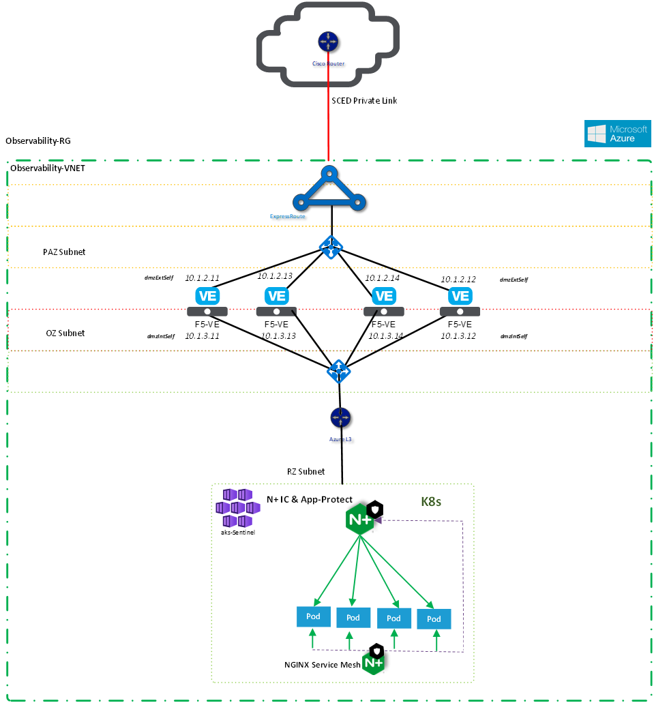

## Service Design

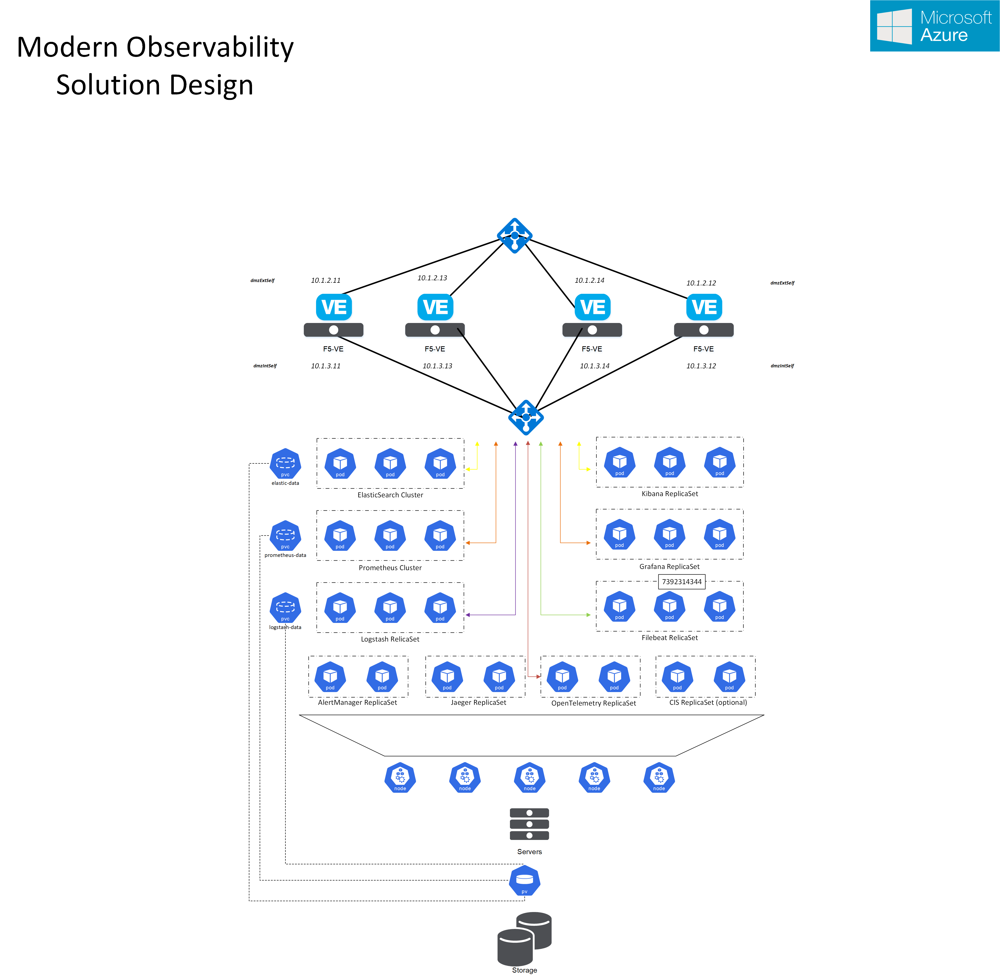

## Logical Flow: Metrics

## Logical Flow: Logs

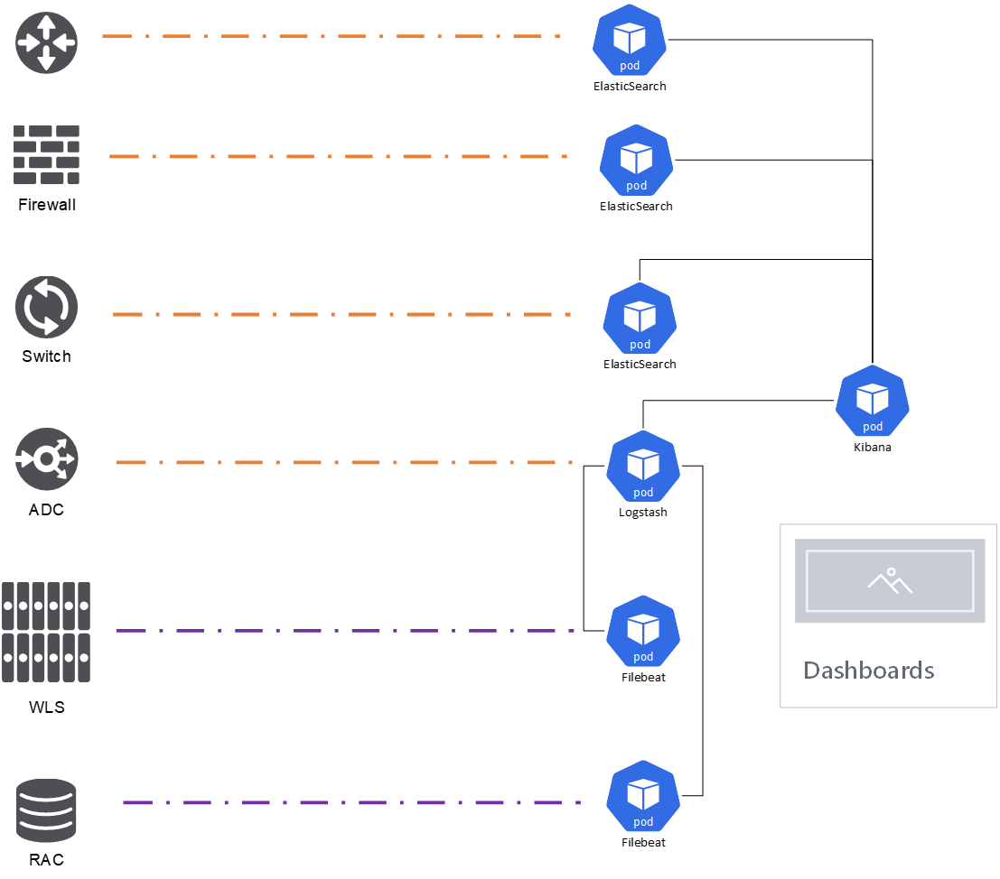

## Logical FLow: Traces

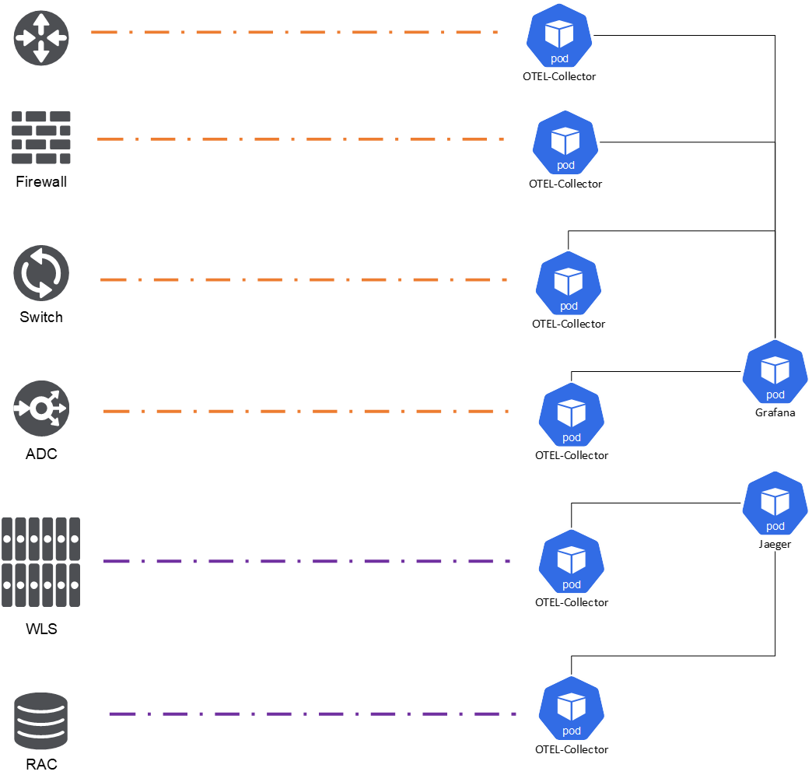

## User Experience

The User Experience is an essential aspect of the platforms success or failure. The following screenshots demonstrate some of the out-of-the-box functionality built into this solution design and reference implementation.

### Login

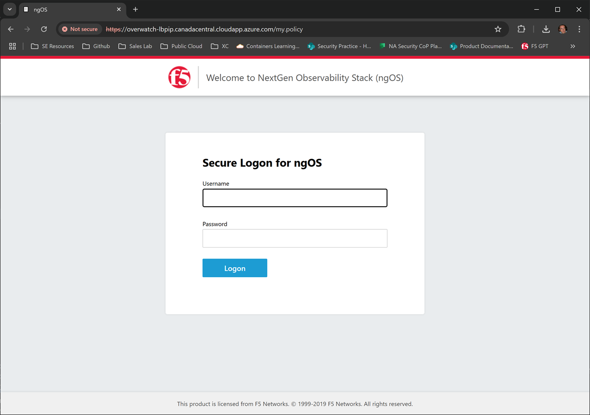

### Webtop

### VPN

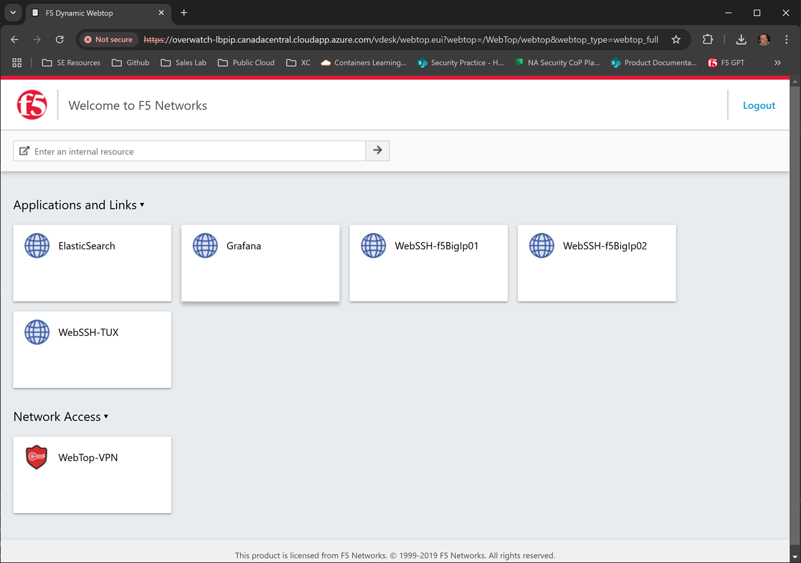

### ElasticSearch

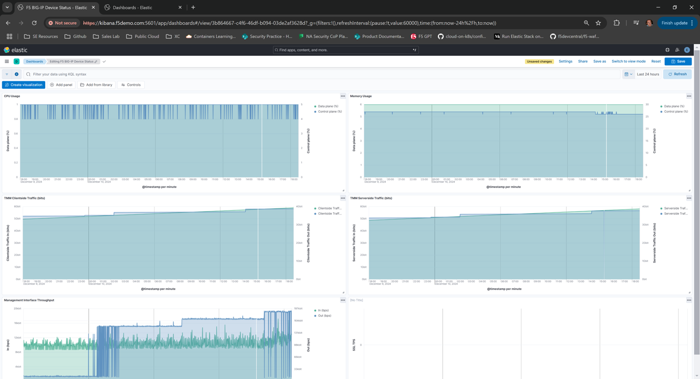
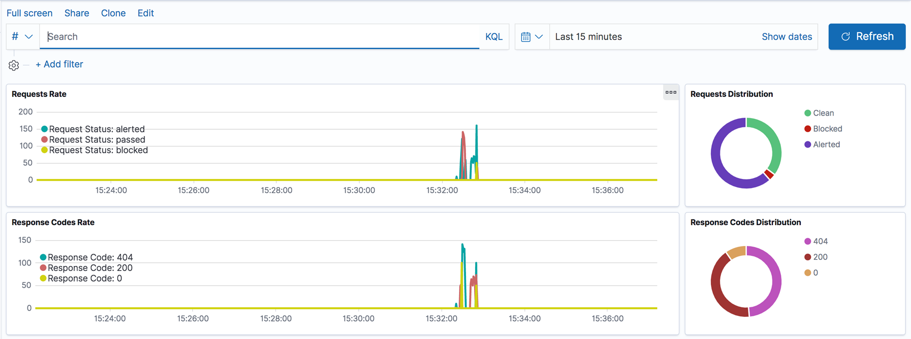
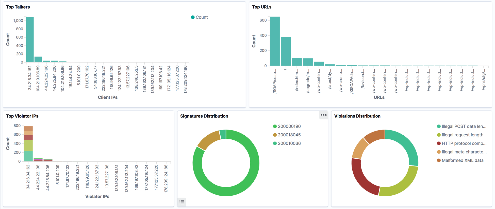
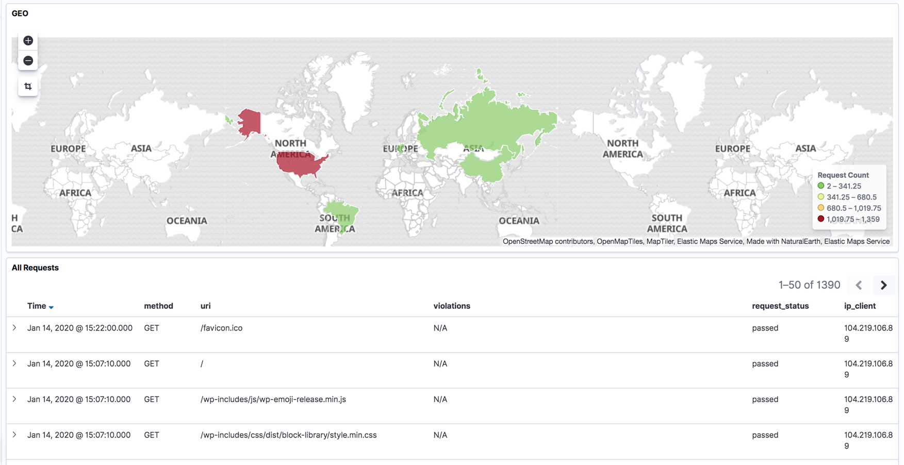
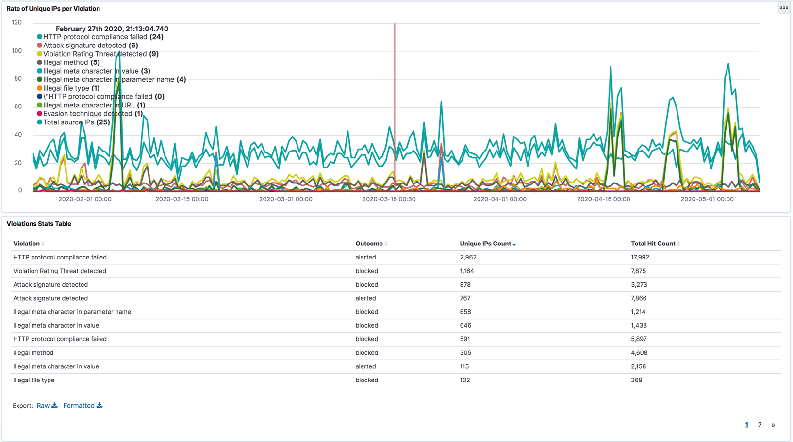
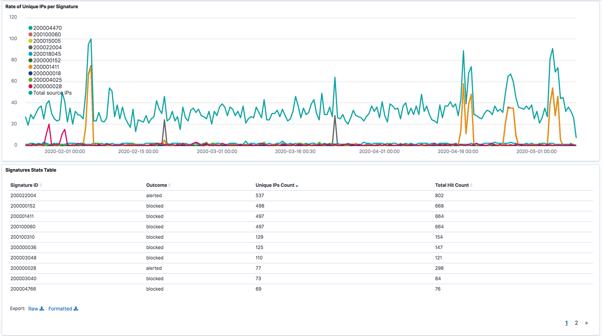

### GrafanaLabs

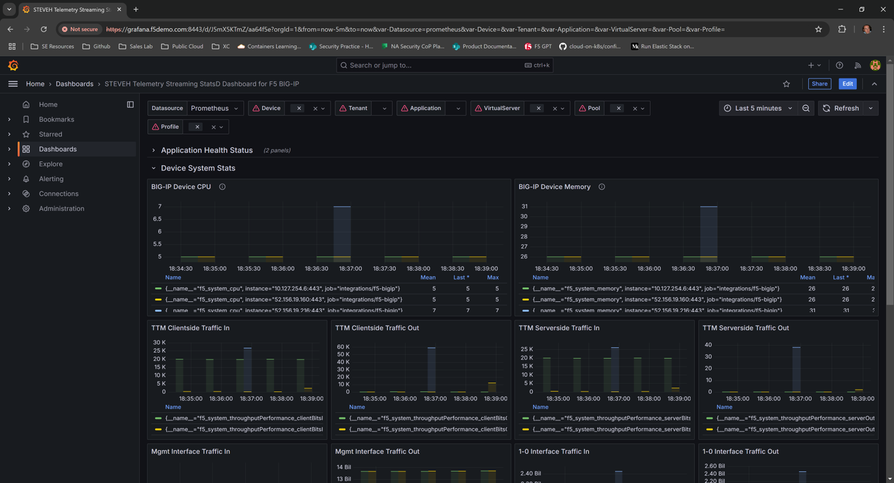

